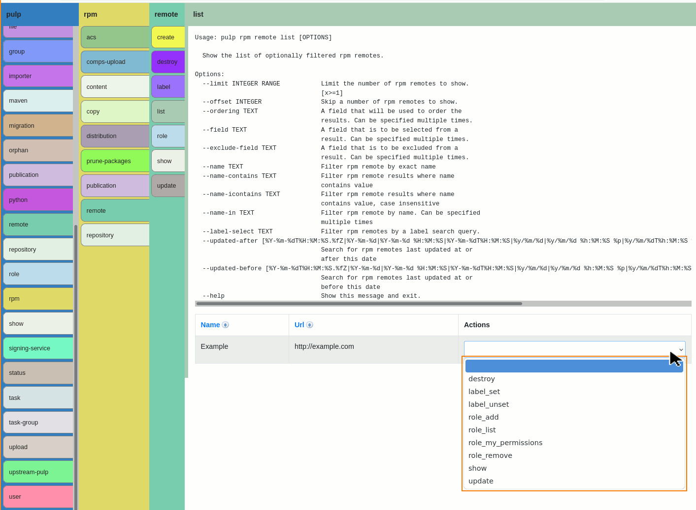

# pulp-cli-wui

This project intends:
* To be a thin wrapper around (and heavily lean upon) `pulp-cli`
* To be an easy "documentation browser" to find the command/options you need for the cli
* To help me learn how to use the cli, and the logic behind how it is laid out.
* To be easily extensible to wrap additional commands, yet provide as much utility as possible without command-specific code.
* To be an alternative web-ui (in every possible respect) in case someone (me) needs one and is unable to use the official wui.
* To promote the peerless Pulp project.

## ...vs. pulp-ui

|                 | [pulp-ui](https://github.com/pulp/pulp-ui) | pulp-cli-wui (this)                                                                      |
|-----------------|--------------------------------------------|------------------------------------------------------------------------------------------|
| Language        | TypeScript                                 | Java                                                                                     |
| Stack           | React? Angular?                            | Apache Tapestry 5                                                                        |
| Effector        | API                                        | CLI                                                                                      |
| WUI-Theory      | Modern                                     | [SSR](https://en.wikipedia.org/wiki/Server-side_rendering)                               |
| Pretty          | Probably*                                  | No (function over comfort)                                                               |
| Made with care? | Probably*                                  | Not quite "quick and dirty", but optimized for functionality per unit-effort to extend.  |
| Functionality   | Probably quite usable/complete             | No. Basically a "usage viewer" and "walking skeleton" at this point, but easy to extend. |

* Note that much of the pulp-ui facts are guessed as I was not able to <u>easily</u> get it to work on my machine and I didn't want to invest a lot of time trying to understand the project, the language, the `npm` packaging/dependencies, or the framework.

## Screenshot

